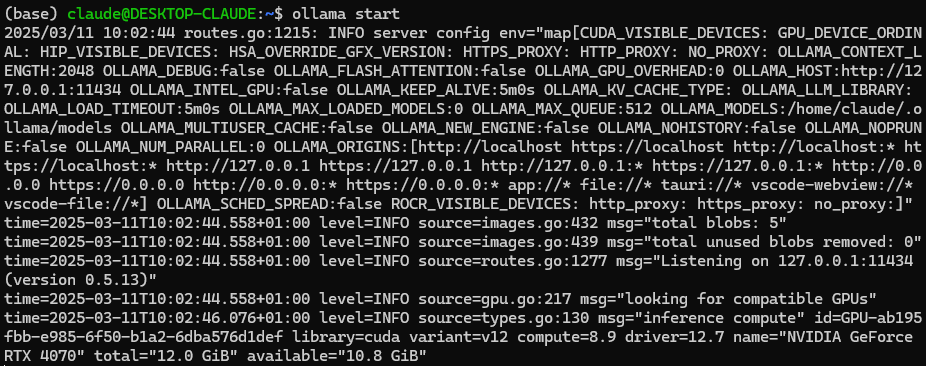
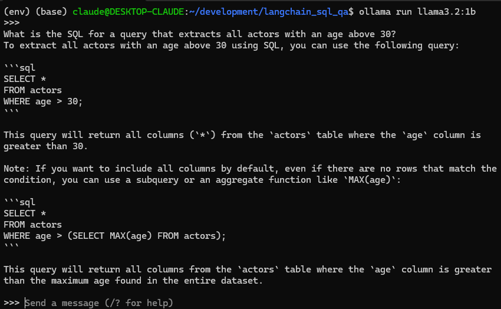

# langchain_sql_qa
Langchain: SQL Q&A Tutorial


## LangChain: Build a Question/Answering System over SQL Data

This repository follows the [LangChain Tutorial](https://python.langchain.com/docs/tutorials/sql_qa/) on Q&A over SQL using LLMs.


### Setup

- Create `venv` virtual environment with `make venv`
- Activate virtual environment (stored in `/env` directory) with `./activate_env.sh` (or `source env/bin/activate`)
- Install dependencies with `make install`

In order to use LLMs, you might have to give some API keys through environment variables. You can do so using the `.env` files. Check the `.env.template` for an example.


### LLM Access

**If you do not have access to an LLM through an API, you can also run your model locally with `Ollama`**
(see [https://python.langchain.com/docs/integrations/chat/ollama/](https://python.langchain.com/docs/integrations/chat/ollama/))


#### Installing Ollama

Check the [Ollama Github](https://github.com/ollama/ollama) for instructions on how to install it on your system.


##### Ollama installation for Windows Subsystem Linux

This blogpost describes the steps to install it in WSL: [https://medium.com/@Tanzim/how-to-run-ollama-in-windows-via-wsl-8ace765cee12](https://medium.com/@Tanzim/how-to-run-ollama-in-windows-via-wsl-8ace765cee12)

If you get an error message when running Ollama about `systemd`, you might have to enable it in WSL specifically.

To do this, edit the `/etc/wsl.conf` and add the following:

```
[boot]
systemd=true
```

Then shutdown the WSL through Powershell with `wsl --shutdown`


#### Running Ollama

You can start ollama by running `ollama start` after the installation. You should see a lot of log output in the console:



After that, start another console and run you desired model. You can choose different models [on the Ollama Github page](https://github.com/ollama/ollama?tab=readme-ov-file#model-library).

For example, we can start a small `Llama 3.2 (1B)` using `ollama run llama3.2:1b`



